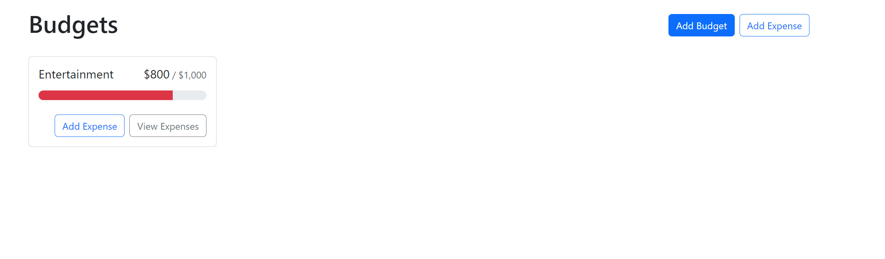

# Budget Tracker Website

## Description
The Budget Tracker Website was created with the aim of addressing the common challenge of budget management by providing users with an intuitive platform to enter, delete, and categorize expenses while gaining insights into their total budget breakdown. This project stands out due to its modern tech stack, featuring React for the front end, GraphQL with Node.js and Express.js for efficient data handling, MongoDB with Mongoose ODM for database management, and JWT authentication for security. The motivation behind the project was to offer a practical solution to empower individuals to take control of their finances. Through its polished UI, responsiveness, and interactive features, this website simplifies budget management, making it a standout tool for financial control and learning experiences in web development.

## Installation
Git clone the repository or copy the folder into your local repository then enter the following into your terminal:
npm i
npm install react dom
npm start

## Screenshots
About Us Section

Budget Tracker Section

## Heroku URL
https://budget-tracking-website-096b741424c0.herokuapp.com/

## GitHub Repository 
https://github.com/karafaris/BudgetTrackingWebsite.git

## Credits
Kara Faris - Github: @karafaris
Mark Podrabinnik - GitHub: @markymark97
Steve Hudek - GitHub: @sjhudek
Mohamed Hussein- Github: @phill-star

 
